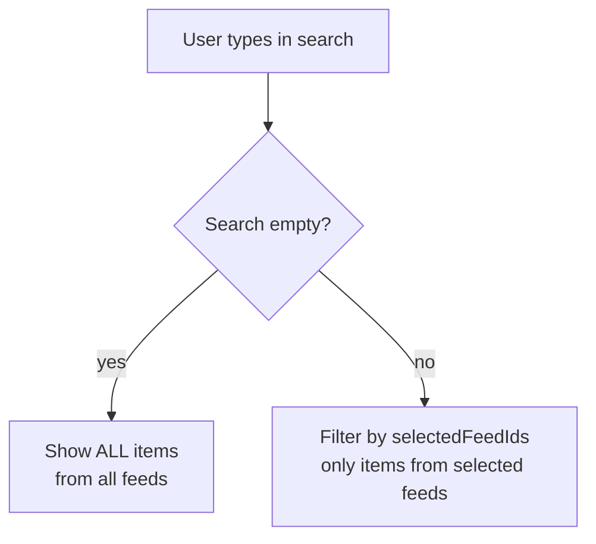
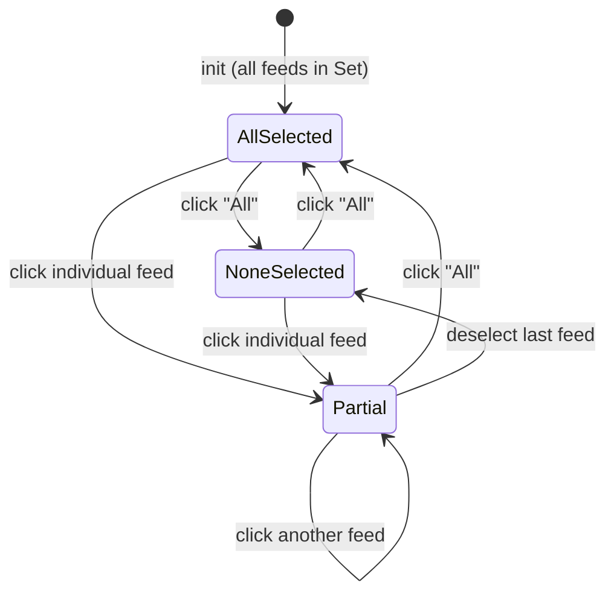
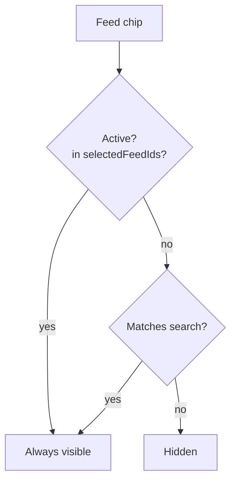
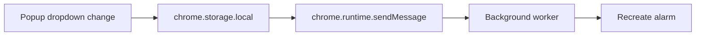
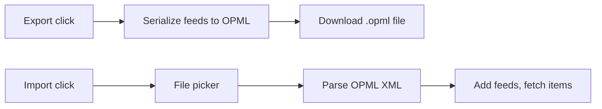
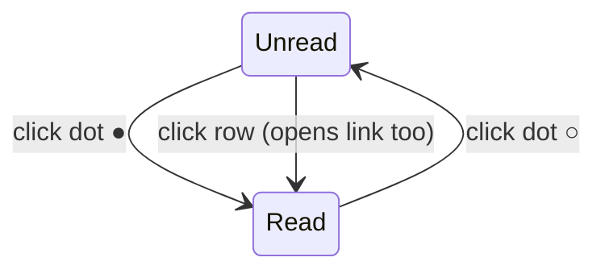
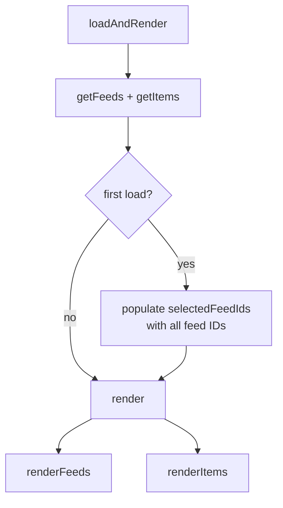

# RSS Reader — State Model

## Selection state

The feed selection controls which feeds' items appear in the list, gated by the search input.

### selectedFeedIds (Set\<string\>)

| State | Meaning |
|---|---|
| Contains all feed IDs | "All" is selected — every feed active |
| Contains some feed IDs | Only those feeds are active |
| Empty | No feeds active — empty list (when search active) |

The Set is initialized with all feed IDs on first load. Adding a feed auto-selects it. Removing a feed removes it from the Set.

### "All" chip

- Always visible in the chip row
- **Highlighted** when `selectedFeedIds.size === feeds.length`
- **Click**: if all feeds selected → clear Set. Otherwise → fill Set with all feed IDs

### Feed chip visibility

## Refresh interval

Stored in `chrome.storage.local` under key `refreshInterval` (minutes). Default: 15.

| Value | Label |
|---|---|
| 5 | Every 5m |
| 15 | Every 15m |
| 30 | Every 30m |
| 60 | Every hour |
| 0 | Manual only |

The popup shows a dropdown next to the refresh button displaying the current interval. Changing it updates storage and sends a message to the background worker to reconfigure the alarm. The background worker reads the interval on startup and on every alarm fire, then re-creates the alarm with the new period (or clears it entirely for manual mode).

## Import / Export (OPML)

OPML 2.0 is the standard interchange format for feed subscriptions. Every major RSS reader supports it.

**Export**: serialize all feeds to an OPML document → trigger download via Blob URL.

**Import**: file picker → parse OPML XML → extract `<outline>` elements with `xmlUrl` → bulk-add feeds (skip duplicates by URL). After import, all new feeds are selected and items are fetched.

Menu: "..." button in header → dropdown with "Import feeds" + "Export feeds". Designed for future expansion (themes, settings, etc.).

## Read/unread state

| Toggle | Effect |
|---|---|
| Show read off (default) | Only unread items visible |
| Show read on | Read items appear dimmed below unread, with ○ dots |

## Render pipeline

Triggers:
- Search input → `render()` (both feeds + items)
- Feed chip click → `render()`
- Item dot/row click → `loadAndRender()` (re-reads storage)
- Add/remove/edit feed → `loadAndRender()`
- Show-read toggle → `renderItems()` only
